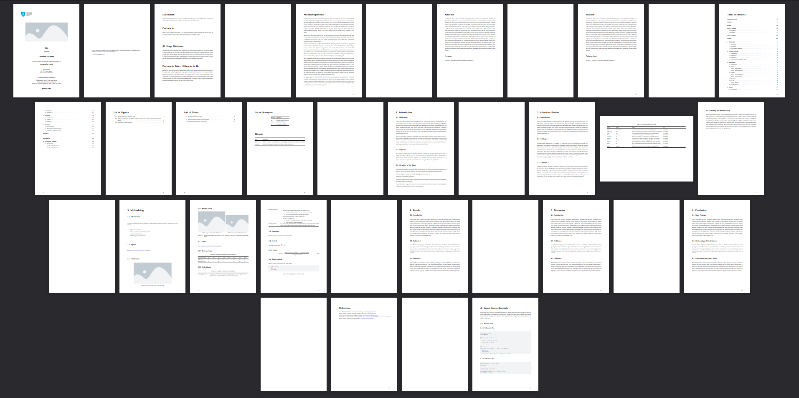
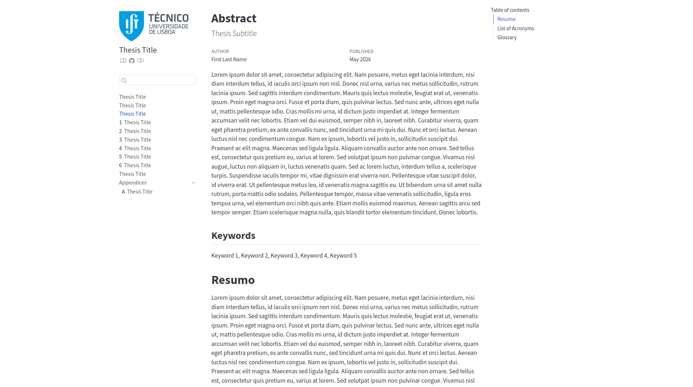

# IST MSc Thesis Quarto Template

This repository aims to share a [Quarto](https://quarto.org/) template for MSc theses at the Instituto Superior Técnico (IST), Universidade de Lisboa.

  |  
:-------------------------:|:-------------------------:
PDF Version             |  Website version
https://gmatosferreira.github.io/ist-msc-thesis-quarto-template/ist-msc-thesis-quarto-template.pdf | https://gmatosferreira.github.io/ist-msc-thesis-quarto-template/

## Why Quarto?

[Quarto](https://quarto.org/) in an open-source scientific and technical publishing system that enables you to write complex documents with a simple syntax, supporting multiple output formats, including PDF (via LaTeX) and HTML. 

I chose it because it is structured enough to avoid the messiness of configuring a large Word Document, but simple enough to avoid the learning curve of LaTeX². With Quarto, you write your documents in plain text, using [Markdown](https://quarto.org/docs/authoring/markdown-basics.html), a simple and easy to learn syntax.

With this template, you can generate simultaneously a [PDF version](https://gmatosferreira.github.io/ist-msc-thesis-quarto-template/ist-msc-thesis-quarto-template.pdf) that meets the IST criteria¹ and a [responsive website](https://gmatosferreira.github.io/ist-msc-thesis-quarto-template/), which eases the dissemination process, with a dynamic and user-friendly interface.

> ¹ Mind that this template was created in the scope of the MSc in Transportation Systems, following the requirements of the [Civil Engineering Department](https://decivil.tecnico.ulisboa.pt/ensino/dissertacoes-de-mestrado). Confirm that it suits your department requirements. Some adjustments might be needed.

> ² Actually, to generate a PDF Quarto uses Latex. However, it abstracts you from the complexity of its syntax, by converting the Markdown you write to Latex in the background when generating the PDF. Still, you can inject Latex to customize your PDF when you need to do some adjustment that is not supported by Quarto. I did it myself to create this template, at `_quarto.yml` in the `format.pdf.include-in-header` section.

## What set up do I need?

Quarto is developed by [Posit](https://posit.co/), a company that has developed its own IDEs, [RStudio](https://posit.co/download/rstudio-desktop) and [Positron](https://positron.posit.co/). They both have native support and a very smooth integration to work with this publishing system.

Nevertheless, there are several plugins that offer you a great integration in other IDEs, such as [VS Code](https://quarto.org/docs/tools/vscode/index.html). 

## How do I start?

This repository already offers you the base structure for the whole document. Each `.qmd` file corresponds to a chapter of your thesis. To start writting, just choose a chapter and replace the "Loren ipsums" by your thesis content.

For some examples on useful components you can include on your document, such as figures, tables or formulas, the Methodology chapter provides you with some examples. Nevertheless, refer to [Quarto website](https://quarto.org/docs/reference/) for a more comprehensive documentation.
